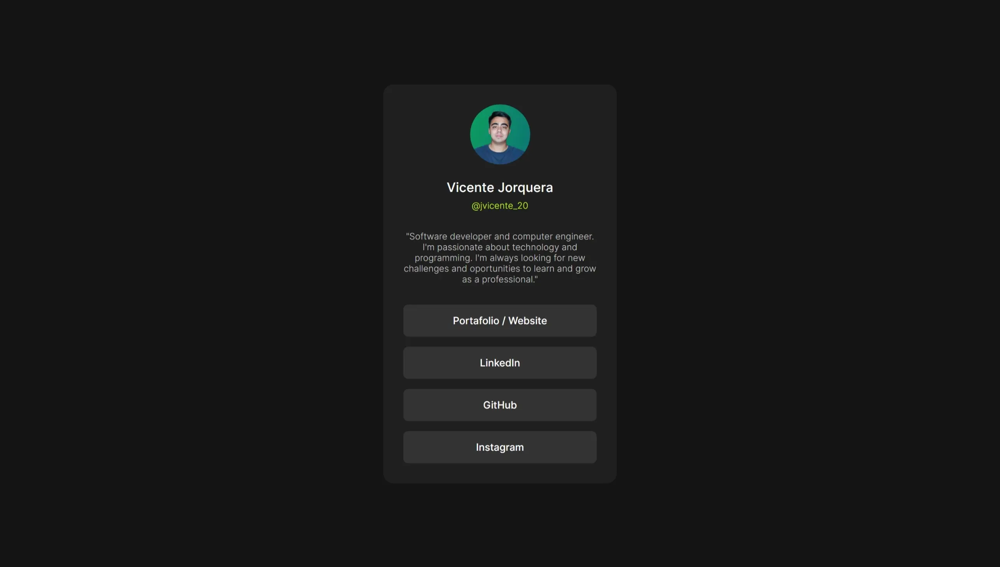

# Frontend Mentor - Social links profile solution by Vicente Jorquera

This is the solution to the [Social links profile challenge on Frontend Mentor](https://www.frontendmentor.io/challenges/social-links-profile-UG32l9m6dQ).

## Table of contents

- [Overview](#overview)
  - [The challenge](#the-challenge)
  - [Screenshot](#screenshot)
  - [Links](#links)
  - [What I learned](#what-i-learned)
- [My process](#my-process)
  - [Built with](#built-with)
  - [What I learned](#what-i-learned)
  - [Useful resources](#useful-resources)
- [Autor](#author)

## Overview

### The challenge

User should be able to:

- See hover and focus states for all interactive elements on the page

### Screenshot

### Links

- Solution URL: [https://github.com/VicenteJ20/social-links-profile](https://github.com/VicenteJ20/social-links-profile)
- Live Site URL: [https://vicentej20.github.io/social-links-profile/](https://vicentej20.github.io/social-links-profile/)

## My process

### Built with

- Semantic HTML5 markup
- CSS custom properties
- Flexbox
- Mobile-first workflow
- Github Pages

### What I learned

I'm gonna be honest, I know HTML5, CSS3 and JavaScript, since more than 1 year ago, so I don't really learned anything new with this solution. I just made it because it was on my list and I wanted to complete all the challenges on it.

### Useful resources

- [www.vicentejorquera.dev](https://www.vicentejorquera.dev) - You can find more about me and my recent projects on my website, feel free to visit my website and let me know on the contact section if you wanna work with me, you will find my social networks too.

- [Github Pages](https://pages.github.com/) - This Github's service help me to deploy my website and get a free domain, check the docs, if you've a domain and want to assign it to a project, you can do it so easily with github pages.

## Author

- My Website - [vicentejorquera.dev](https://www.vicentejorquera.dev)
- Frontend Mentor - [@VicenteJ20](https://www.frontendmentor.io/profile/VicenteJ20)
- Twitter - [@jvicente_20](https://www.twitter.com/jvicente_20)